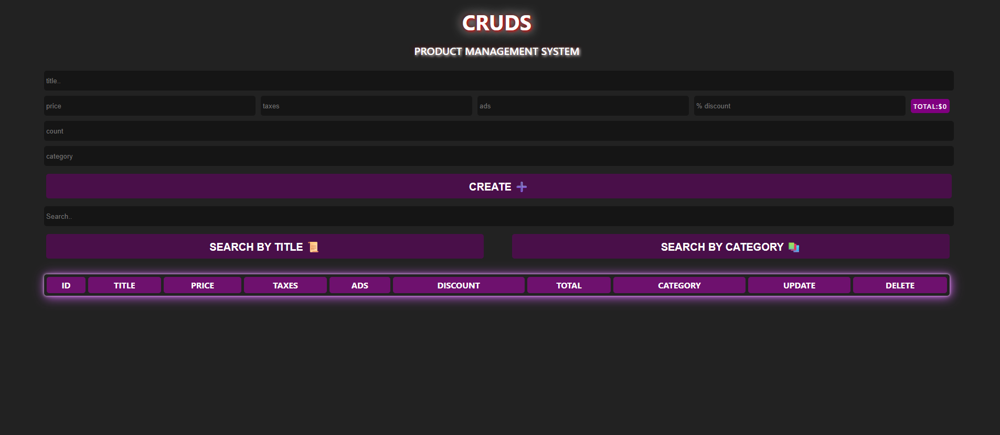

# 🟣 CRUDS — Product Management System

A simple product management app with full CRUD (Create, Read, Update, Delete) functionality, built with plain HTML, CSS, and JavaScript.

<p align="left">
  
  
  
</p>

🔗 **[Live Demo](https://mahmooodd.github.io/simple-crud-project/)**

## 🖼️ Preview

<p align="center">
  
</p>

## ✨ Features

- ➕ Add new products (title, price, taxes, ads, discount %, count, category)
- 🧮 Auto-calculated total price per product
- 🔍 Search by title or category
- ✏️ Update existing products
- 🗑️ Delete products
- 💾 Data persisted in the browser via `localStorage`

## 🚀 Getting Started

```bash
git clone https://github.com/MAHMOOODD/simple-crud-project.git
cd simple-crud-project
```

Just open `index.html` in your browser — no build step or dependencies needed.

## 👤 Author

**Mahmoud Salah** — Computer Science student, Cairo University, focused on full stack development.

[](https://github.com/MAHMOOODD)
[](https://www.linkedin.com/in/mahmoud-salah-b9a297338/)

---

© 2026 Mahmoud Salah. All rights reserved.
